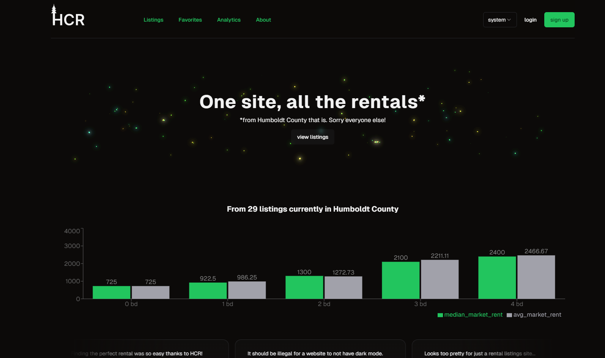

# HCR

Humboldt county renting

coming soon to a county near you ;)

## TO DO

- [ ] Clean up types for theme
- [ ] Split out components from jxs spaghetti
- [ ] Users and auth
- [ ] Private Landlords feature

## Users and auth

Set up visitors to be able to create a user profile. This allows you to favorite and comment on listings, save search filters, receive email notifications, and more.

### Database changes

The structure of the DB in response to this feature should be:

- [ ] Create users and profiles tables. Users will be standard Supabase user auth table, profiles will be in the public schema that users will be able to update by taking certain actions.
  - [ ] Profiles have fkey for associated property management (or null)
- [ ] Create favorites table. Fkeys for profiles and listings.
- [ ] Create comments table. Fkeys for profiles and listings.
- [ ] Create property management ratings table. Fkeys for profiles and property managements.
- [ ] Create user reports table. Fkey for users and cols (not fkeys) for `table_name` and `record_id`
  - [ ] Set up admin interface to review reports

### UI changes

- [ ] Ability to create a user profile
  - [ ] Email (required)
  - [ ] Password (required)
  - [ ] First name (required)
  - [ ] Last name optional (unless associated with a property management)
  - [ ] Association with a property management (optional, multi-select, allow custom)
  - [ ] (planned) Profile picture upload
- [ ] Ability to favorite listings
  - [ ] Ability to view your own favorites
- [ ] Ability to comment on listings
  - [ ] Ability to view comment history for any profile
- [ ] Ability to rate property managements
- [ ] Ability to report property managements, listings, comments

## Private Landlords feature

Add a way for private landlords to apply to be able to post on HCR. This would allow for listings to be made and inserted to the DB without the scraper doing that work.

### Database changes

The structure of the DB in response to this feature should be:

- [ ] Add column to property manager table that denotes if they are `private` or not
- [ ] PMs marked `true` for `private` will not be used by the scraper
  - [ ] Add query filter in `hcr-backend` to do this

## Listing uploads

A method of being able to upload/edit listings will need to be available to users who are granted the ability to post on behalf of PLs.

- [ ] Disclaimers:
  - Photos _must_ be hosted elsewhere. Provide URLs directly to each image and whatever is retrieved from that URL is what will be displayed.
  - Videos _must_ be hosted on Youtube.
  - HCR will _not provide_ any application processing services. You must handle that on your own outside of the website.
- [ ] Given inputs for pretty much every column
  - [ ] Certain columns will be automatically updated in the backend
- [ ] Ability to edit and delete listings that have authority on
